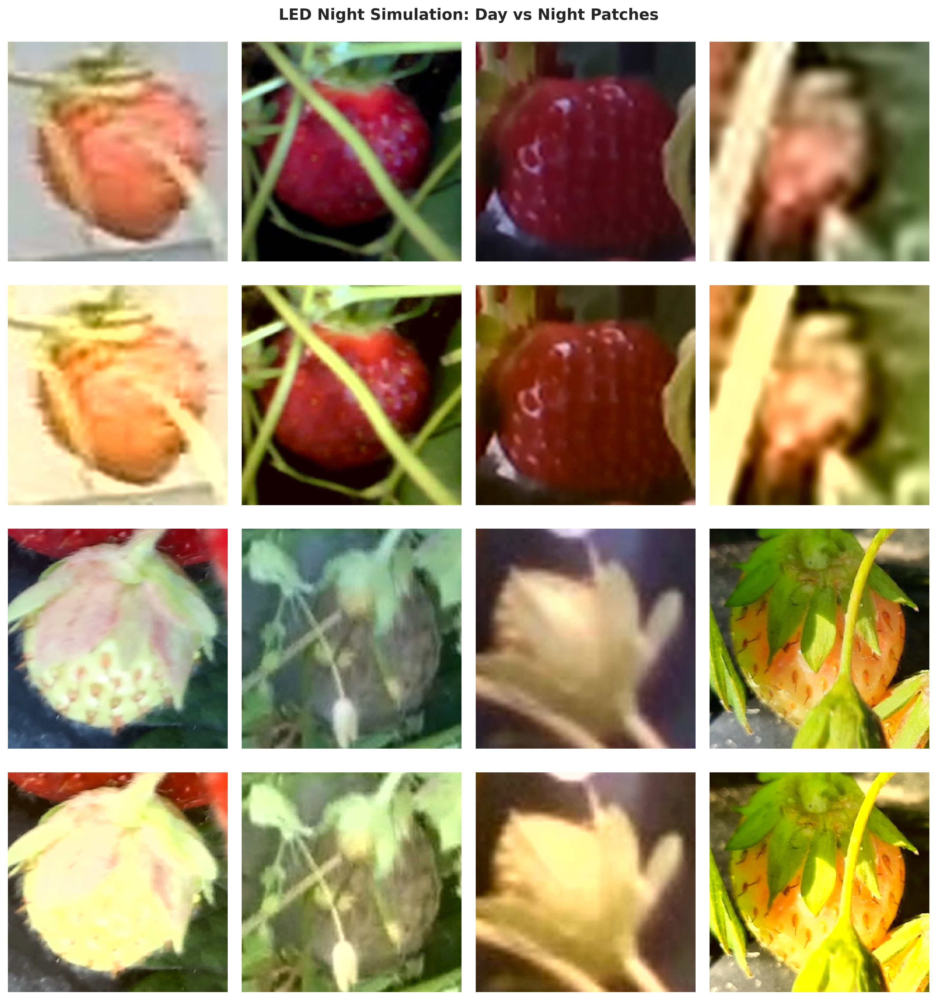
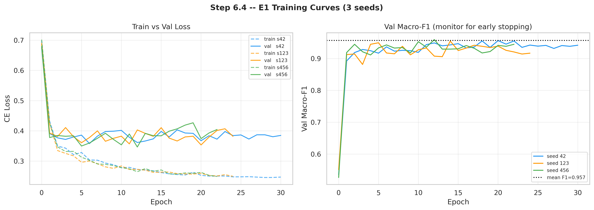

# Strawberry Ripeness Classification Under LED-Induced Domain Shift

> A computer-vision study quantifying and mitigating the accuracy drop that occurs
> when a strawberry-ripeness classifier trained on **daytime** images is deployed
> under **onboard LED lighting** at night — a real failure mode for agricultural
> harvesting robots.

---

## Problem & motivation

Autonomous strawberry-harvesting robots are typically trained on daytime field
imagery but operate around the clock under onboard LED illumination. The LED
spectral distribution shifts the input distribution away from the training data
(**domain shift**), degrading ripeness-classification accuracy at night — exactly
when a reliable model is most needed. This project measures that degradation
rigorously and tests whether modern CNNs and domain-adaptation techniques close the
gap.

## Approach

Framed as **patch classification** (not object detection) on a public agricultural
dataset (Pastell & Liakka, Luke Finland; 813 images, YOLO annotations, CC BY 4.0),
with a fixed train/val/test split frozen up front and reused across every
experiment for fair comparison. Five controlled experiments:

| Exp | What it tests |
|---|---|
| **E1** | Deep-learning baseline (ConvNeXt) on daytime patches |
| **E2** | Classical ML baseline (SVM on HSV colour features), day vs night |
| **E3–E5** | Quantify the day→night ΔF1 and test domain-adaptation strategies |

Findings are interpreted with **Grad-CAM** to show *where* the models attend and how
that attention breaks down under the lighting shift. Hypotheses (e.g. "a
colour-sensitive HSV+SVM baseline degrades more than a deep model under domain
shift") are stated in advance and tested empirically.

## Tech stack

PyTorch · ConvNeXt (transfer learning) · scikit-learn (SVM) · Grad-CAM ·
HSV colour analysis · macro-F1 / per-class precision-recall · Google Colab (T4).

Reproducibility: fixed seeds across Python/NumPy/PyTorch(+CUDA),
`cudnn.deterministic=True`, and a persisted split CSV used as ground truth.

## Results

The headline finding: **a classical colour-based model collapses under the night
shift, while the deep model stays robust** — confirming the central hypothesis.

| Experiment | Model | Test split | Macro-F1 | AUC-ROC |
|---|---|---|---:|---:|
| E1 | ConvNeXt-Tiny | day | **0.957** | 0.981 |
| E2 | SVM (RBF, HSV) | day | 0.905 | 0.967 |
| E2 | SVM (RBF, HSV) | **night** | **0.748** ⬇ | 0.891 |
| E3→E4 | ConvNeXt-Tiny | day → night | ΔF1 = **0.008** | — |

- The **SVM baseline drops 0.905 → 0.748** (≈16 pts macro-F1) from day to night —
  a statistically significant degradation (95% CI), as predicted for a
  colour-sensitive model under LED-induced shift.
- **ConvNeXt-Tiny degrades by only ΔF1 ≈ 0.008** day→night (E4) and retains 99.7%
  of its day-time performance — i.e. the deep model is largely shift-robust where
  the classical one is not.

Full per-class metrics, ROC/PR curves, confusion matrices, training curves, and
Grad-CAM visualisations are in [`results/`](results/) and the notebook
[`strawberry_domain_shift.ipynb`](strawberry_domain_shift.ipynb).




## How to run

```bash
# Open in Google Colab (GPU runtime) and run all cells:
#   strawberry_domain_shift.ipynb
# The notebook mounts Google Drive for the dataset, checkpoints, and the
# frozen split CSV, then runs experiments E1–E5 in order.
```

## Limitations & next steps

- Single public dataset; results would benefit from validation on additional
  field-captured night imagery.
- Patch classification simplifies the real detection-then-classify pipeline.
- Future work: explicit illumination-invariant augmentation / colour-constancy
  pre-processing, and a generative day→night style transfer for adaptation.

---

*Individual MSc Applied AI coursework (University of Warwick, WMG — AI & Deep Learning).*
